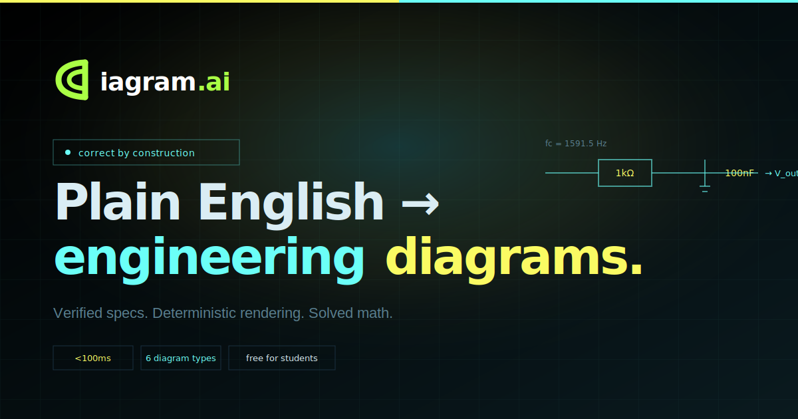
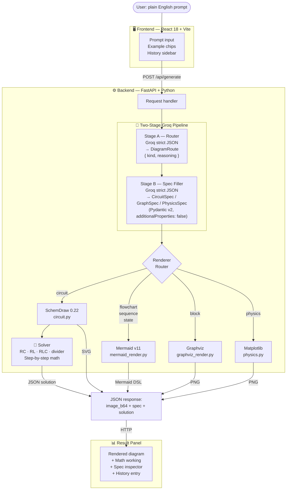

<div align="center">



<br/>

[](https://dgram-ai.onrender.com)
[](https://dgram-ai.onrender.com/api-docs)
[](https://console.groq.com)
[](https://python.org)
[](https://react.dev)

<br/>

> **Plain English → verified specification → deterministic diagram + solved engineering math.**  
> The LLM never draws anything. It fills a schema. A deterministic renderer draws from that schema.  
> Correct by construction.

</div>

---

## ⚡ The Core Idea

Most "AI diagram" tools ask a language model to generate pixels or code and hope for the best. That produces hallucinated wires, floating components, and circuits that couldn't power an LED.

DiagramAI inverts this entirely:

```
  Your Prompt                            Output
  ──────────                            ──────
  "RC low-pass filter      →   Electrically valid schematic
   with 1kΩ and 100nF"         + fc = 1591.5 Hz (with working)
                                + JSON spec you can inspect
```

The LLM's only job is **filling a typed Pydantic schema** using Groq's constrained decoding (strict JSON schema mode). Constrained decoding means the model is **physically incapable** of emitting JSON that violates the schema. A deterministic library renders from that spec. The diagram is correct because the spec is correct — by construction.

---

## 🆚 How DiagramAI Compares

| | DALL-E / Stable Diffusion | Mermaid / draw.io | **DiagramAI** |
|---|:---:|:---:|:---:|
| **Input** | prompt | code syntax | plain English |
| **Output** | pixels (often wrong) | diagram (manual) | **verified diagram + math** |
| **Circuits** | nonsense symbols | not supported | ✅ electrically correct |
| **Physics** | blurry arrows | not supported | ✅ proper free-body diagrams |
| **Solves math** | ❌ | ❌ | ✅ step-by-step working |
| **Schema-validated** | ❌ | ❌ | ✅ Pydantic v2 |
| **API-first** | ❌ | ❌ | ✅ JSON spec in every response |

---

## 🏗️ Architecture



### Key Insight

The LLM pipeline has two stages, each using Groq's strict JSON schema mode:

| Stage | Input | Output | Purpose |
|-------|-------|--------|---------|
| **A — Route** | raw prompt | `DiagramRoute { kind, reasoning }` | classify diagram type |
| **B — Fill** | prompt + kind | `CircuitSpec / GraphSpec / PhysicsSpec` | populate exact schema |

`additionalProperties: false` + full `required` list on every nested object = the model cannot hallucinate fields or omit required ones. The spec is the contract.

---

## 🎨 Supported Diagram Types

| Type | Renderer | Math Solver | Example Prompt |
|------|----------|:-----------:|----------------|
| **Electrical Circuit** | SchemDraw | ✅ RC · RL · RLC · divider | `"RC low-pass filter, 1kΩ, 100nF"` |
| **Flowchart** | Mermaid | — | `"binary search algorithm"` |
| **Block / Architecture** | Graphviz | — | `"microservices: client, gateway, auth, DB"` |
| **Sequence Diagram** | Mermaid | — | `"user login via REST API"` |
| **State Machine** | Mermaid | — | `"traffic light FSM"` |
| **Physics / Free Body** | Matplotlib | — | `"block on incline, 30°, μ=0.3"` |

---

## 🚀 Quick Start

### Prerequisites

- Python 3.10+, Node.js 18+
- Graphviz system package: `brew install graphviz` / `apt install graphviz` / `choco install graphviz`
- Free [Groq API key](https://console.groq.com) *(optional — full offline fallback included)*

### Setup

```bash
git clone https://github.com/Tanny28/dgram-ai.git
cd dgram-ai

# Backend
cd backend
cp .env.example .env        # paste GROQ_API_KEY here
pip install -r requirements.txt
cd ..

# Frontend
cd frontend
npm install
cd ..
```

### Run

```bash
# Terminal 1 — backend (http://localhost:8000)
cd backend && python app.py

# Terminal 2 — frontend (http://localhost:5173)
cd frontend && npm run dev
```

---

## 📡 API

### `POST /api/generate`

```bash
curl -X POST https://dgram-ai.onrender.com/api/generate \
  -H "Content-Type: application/json" \
  -d '{"prompt": "RC low-pass filter with 1kOhm and 100nF"}'
```

```jsonc
{
  "ok": true,
  "kind": "circuit",
  "title": "RC Low-Pass Filter",
  "spec": {
    "components": [
      { "id": "V1", "type": "source_sin", "label": "Vin" },
      { "id": "R1", "type": "resistor",   "label": "1kΩ" },
      { "id": "C1", "type": "capacitor",  "label": "100nF" }
    ],
    "connections": [
      { "source": "V1", "target": "R1" },
      { "source": "R1", "target": "C1" },
      { "source": "C1", "target": "V1" }
    ],
    "topology": "series"
  },
  "image_b64": "iVBOR...",        // base64 PNG/SVG — render directly
  "solution": {
    "solvable": true,
    "summary": "RC filter cutoff frequency = 1591.5 Hz",
    "steps": ["τ = R·C = 1000 × 100e-9 = 0.0001 s", "fc = 1/(2π·τ) = 1591.5 Hz"],
    "quantities": { "Cutoff frequency": "1591.5 Hz", "Time constant": "0.1 ms" }
  },
  "meta": { "elapsed_ms": 84, "offline": false }
}
```

See the full interactive reference at [`/api-docs`](https://dgram-ai.onrender.com/api-docs).

---

## 🗂️ Project Structure

```
dgram-ai/
├── backend/
│   ├── app.py                   # FastAPI server, all routes
│   ├── requirements.txt
│   ├── .env.example
│   └── core/
│   │   ├── schemas.py           # Pydantic v2 specs (CircuitSpec, GraphSpec, PhysicsSpec)
│   │   ├── brain.py             # Two-stage Groq pipeline (route → spec)
│   │   ├── solver.py            # Analytical circuit math (RC, RL, RLC, divider)
│   │   └── offline_fallback.py  # Keyword router + canned specs (no-key demo)
│   └── renderers/
│       ├── circuit.py           # SchemDraw electrical renderer
│       ├── mermaid_render.py    # Mermaid DSL generator (flowchart/sequence/state)
│       ├── graphviz_render.py   # Graphviz PNG renderer
│       └── physics.py          # Matplotlib free-body diagram renderer
├── frontend/
│   ├── index.html               # SEO: OG tags, JSON-LD, canonical
│   └── src/
│       ├── App.jsx              # Main SPA (prompt, results, history, OAuth)
│       ├── ApiDocs.jsx          # Interactive API documentation
│       └── styles.css           # Design system (dark + #aaff45 accent)
├── Dockerfile                   # Single-container build (backend serves built frontend)
├── render.yaml                  # One-click Render deploy (free tier)
└── docker-compose.yml
```

---

## 🛠️ Tech Stack

| Layer | Technology | Why |
|-------|-----------|-----|
| **LLM inference** | Groq (`openai/gpt-oss-120b`) | Fastest inference + strict JSON schema mode (constrained decoding) |
| **Schema validation** | Pydantic v2 | `model_json_schema()` feeds directly into Groq's `response_format` |
| **Circuit rendering** | SchemDraw 0.22 | Code → electrically correct SVG schematics |
| **Graph rendering** | Mermaid v11 | Flowcharts, sequence diagrams, state machines from DSL |
| **Block rendering** | Graphviz | Ranked-layout block and architecture diagrams |
| **Physics rendering** | Matplotlib | Force vectors, free-body diagrams |
| **Backend** | FastAPI + Uvicorn | Async Python, auto Swagger docs, OAuth2 |
| **Auth** | Google OAuth + authlib | Session cookies, optional — graceful degradation |
| **Database** | SQLAlchemy 2.0 + SQLite | History sync, ephemeral on free Render tier |
| **Frontend** | React 18 + Vite | SPA with pathname routing, no router lib |
| **Deploy** | Render (Docker) | Single-container, one-click Blueprint deploy |

---

## 🔌 Offline Mode

No API key? No internet? No problem.

DiagramAI ships with a keyword-based fallback router and a library of curated canned specs. The demo never dies on bad conference wifi. The UI shows an amber dot with **"offline / fallback engine"** when running in this mode — full transparency to the user.

---

## 🔐 Google OAuth (optional)

Signed-in users get cloud history sync across devices. History is stored in SQLite on the backend instead of browser `localStorage`. When OAuth is not configured, the sign-in button auto-hides and localStorage is used — nothing breaks.

Setup: create an OAuth 2.0 Web Client ID on [Google Cloud Console](https://console.cloud.google.com/apis/credentials) and add to `backend/.env`:

```env
GOOGLE_CLIENT_ID=...
GOOGLE_CLIENT_SECRET=...
SESSION_SECRET=<32-byte hex>
```

---

## ☁️ Deploy to Render (one click)

1. Fork / push to GitHub
2. [Render](https://render.com) → **New → Blueprint** → connect repo
3. Set env vars: `GROQ_API_KEY`, `SESSION_SECRET`, optionally `GOOGLE_CLIENT_ID/SECRET`
4. Click **Create** — build takes ~4 minutes

The free tier sleeps after 15 min inactivity (first request ~30s cold start). Paid plans avoid this.

---

## 🛣️ Roadmap

The current prototype proves the core thesis: **constrained decoding + deterministic rendering = correct-by-construction diagrams**. Future development tracks:

### Near-term
- [ ] **Permalink sharing** — encode spec in URL, share a diagram with one link
- [ ] **Explain button** — LLM explains the generated diagram step by step
- [ ] **Embed code** — `<iframe>` snippet for docs and reports
- [ ] **More circuit types** — op-amps, transistors, bridge rectifiers, H-bridges
- [ ] **Bode plots** — frequency response rendered alongside filter schematics

### Medium-term
- [ ] **Diagram editor** — click any component in the rendered output to edit the spec
- [ ] **Multi-diagram canvas** — combine a circuit, its Bode plot, and a state machine in one workspace
- [ ] **Templates gallery** — searchable library of common engineering patterns
- [ ] **Export** — PNG, SVG, PDF, LaTeX (`circuitikz`), KiCad netlist

### Long-term (enterprise / product vision)
- [ ] **Spec-to-simulation** — export CircuitSpec directly to SPICE/ngspice for simulation
- [ ] **Real-time collaboration** — shared canvas, live cursor, conflict-free edits (CRDTs)
- [ ] **LMS integration** — embed in Canvas/Moodle as an assignment tool; auto-grade diagrams against a rubric
- [ ] **IDE plugin** — generate and inline diagrams in VS Code / JetBrains from a docstring
- [ ] **Private deployment** — self-hosted with custom model endpoints (on-prem for universities)

---

## 🔬 Why "Correct by Construction"

The phrase is borrowed from formal verification. In hardware design, a circuit is *correct by construction* if the design rules guarantee correctness before simulation. DiagramAI applies this to AI output:

1. **Pydantic schema defines the contract** — every field typed, every enum constrained
2. **Groq strict mode enforces the contract at inference time** — `additionalProperties: false`, all fields `required` — the model cannot emit invalid JSON
3. **Deterministic renderer consumes the contract** — SchemDraw/Mermaid/Graphviz never see free-form LLM text, only a validated data structure
4. **Math solver derives quantities analytically** — no LLM involved in the arithmetic

The result: the diagram reflects exactly what the schema says, and the schema reflects exactly what the user asked for. No hallucinated wires. No floating components. No wrong cutoff frequencies.

---

<div align="center">

Built by **Tanmay Shinde** · [Live Demo](https://dgram-ai.onrender.com) · [API Docs](https://dgram-ai.onrender.com/api-docs)

</div>
